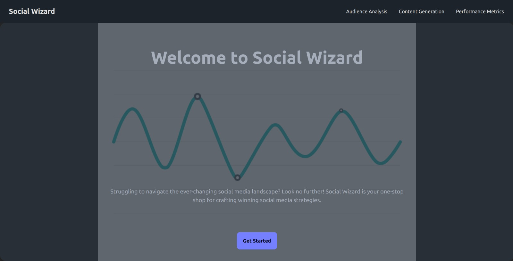
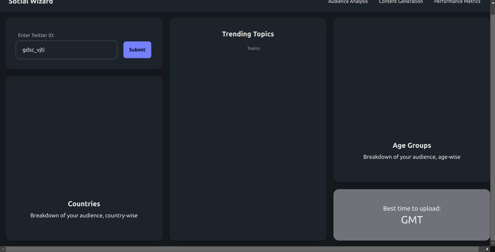
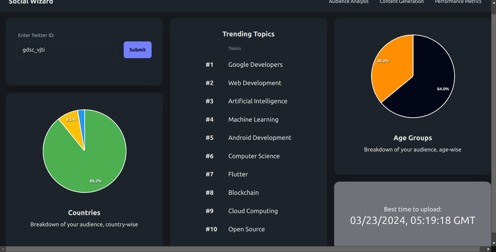
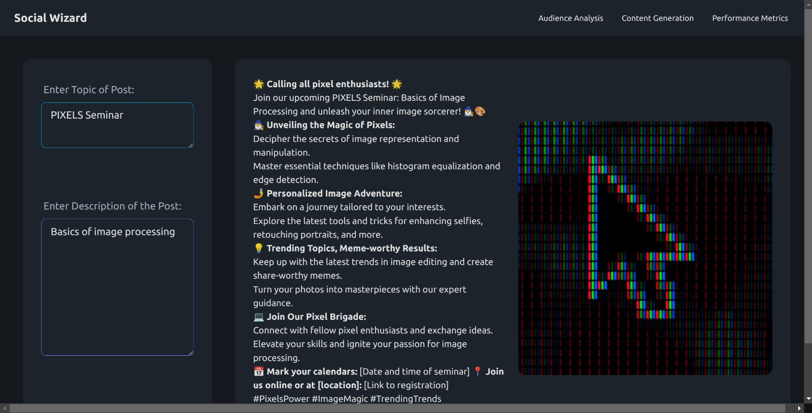
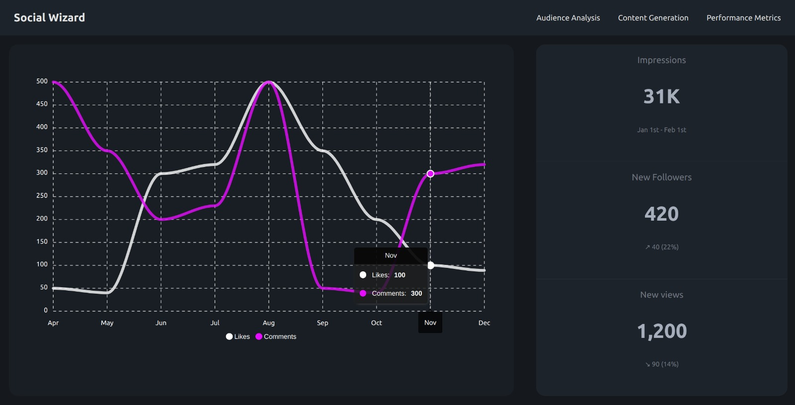

# Social Wizard

## Table of Contents

- [Project](#social-wizard)
  - [Table of Contents](#table-of-contents)
  - [About The Project](#about)
  - [Demo](#demo)
  - [Tech Stack](#tech-stack)
  - [File Structure](#file-structure)
  - [Getting started](#Getting-Started)
  - [Screenshots of Website](#screenshots-of-website)
  - [Future Scope](#future-scope)
  - [Contributors](#contributors)
  - [License](#license)

## About

The project aims to create an AI-powered tool to assist small businesses in developing effective social media marketing campaigns. The tool analyzes target audience demographics, suggests personalized content, optimizes posting schedules for maximum engagement, and tracks campaign performance in real-time.

Features:

* Audience Analysis: Utilize AI to analyze target audience demographics, psychographics, and behaviors.
* Content Suggestions: Provide personalized content suggestions, including text, images, and hashtags, based on audience analysis.
* Posting Schedule Optimization: Recommend optimal times and frequencies for posting on various social media platforms to maximize engagement.
* Performance Tracking: Track campaign performance in real-time and offer insights for improvement.
  
## Demo

https://github.com/PritK99/Social-Wizard/assets/103848930/8042e608-aa49-4029-b6c5-412c15618351

## Tech Stack

- 

- 

- 

- 

## File Structure
```
👨‍💻Social-Wizard
 ┣ 📂assets                            // Contains all the reference gifs, images
 ┣ 📂frontend                          // Client side       
 ┃ ┃ ┣ 📂src                                       
 ┃ ┃ ┃ ┣ 📄App.js
 ┃ ┃ ┣ 📂public 
 ┃ ┃ ┣ 📄index.html
 ┣ 📂backend                           // Server side
 ┃ ┣ 📄local_setup.sh
 ┃ ┣ 📄local_run.sh
 ┃ ┣ 📄analysis.py
 ┃ ┣ 📄gemini.py
 ┃ ┣ 📄generator.py
 ┃ ┣ 📄image_gen.py
 ┃ ┣ 📄README.md 
 ┃ ┣ 📄requirements.txt      
 ┣ 📄README.md
 ┣ 📄Social Media Campaign Management.pptx
``` 

## Getting Started

### Installation

Clone the project by typing the following command in your Terminal/CommandPrompt

```
git clone https://github.com/PritK99/Social-Wizard
```
Navigate to the Social Wizard folder

```
cd Social-Wizard
```

#### Frontend

Open a new terminal in root folder and navigate to the client folder

```
cd frontend
```

Install all the required dependencies

```
npm i
```

To run the frontend

```
npm run dev
```

Once the above command is executed, the frontend will be running at ```localhost:5713```. You can visit http://localhost:5713/ to view the website.

#### Backend

If you are using Linux Operating System, you can run the backend simply by running the shell script as given below.

```bash
chmod +x local_setup.sh
```

```bash
chmod +x local_run.sh
```

```bash
./local_setup.sh
```

Next, set the below 3 environment variables using EXPORT command in local_run.sh file using your own API keys:

```
EXPORT GEMINI_API_KEY = 
```
```
EXPORT UNSPLASH_ACCESS_KEY = 
```
```
EXPORT RAPID_API_KEY = 
```

```bash
./local_run.sh
```

For Windows and Other Systems

```
cd backend
```

Create a virtual environment to install all the dependencies

```
python -m venv socialwiz
```

Activate the virtual environment

For Windows: ```socialwiz\Scripts\activate```

For Linux: ```source socialwiz/bin/activate```

Install all the required dependencies

```
pip install -r requirements.txt
```

Next, set the below 3 environment variables using SET command using your own API keys:

```
SET GEMINI_API_KEY = 
```
```
SET UNSPLASH_ACCESS_KEY = 
```
```
SET RAPID_API_KEY = 
```

To run the backend

```
python main.py
```

## Screenshots of the Website

- #### Home Page

    

- #### Audience Analysis

    

    

- #### Content Generation

    

- #### Performance Metrics

    


## Contributors

- [Pranav Shukla](https://github.com/pranavshuklaa)
- [Prit Kanadiya](https://github.com/PritK99)
- [Raghav Agarwal](https://github.com/Raghav323)
- [Vedant Nimje](https://github.com/vrnimje)

## Future Scope

* Market Analysis: Analyze the data from various different platforms and showcase the growth in engagement , likes and overall reach.

* Optimal posting method: Using Reinforcement Learning to determine best time for posting content across different platforms.

* Auto scheduling: Building a scheduler which automatically schedules post at different time intervals

## References
- [Gemini API](https://ai.google.dev/) for content generation.
- [Unsplash API](https://unsplash.com/developers) for image generation from text.
- [Rapid API](https://rapidapi.com/) for data collection from twitter (rebranded as X)

## License
[MIT License](https://opensource.org/licenses/MIT)
